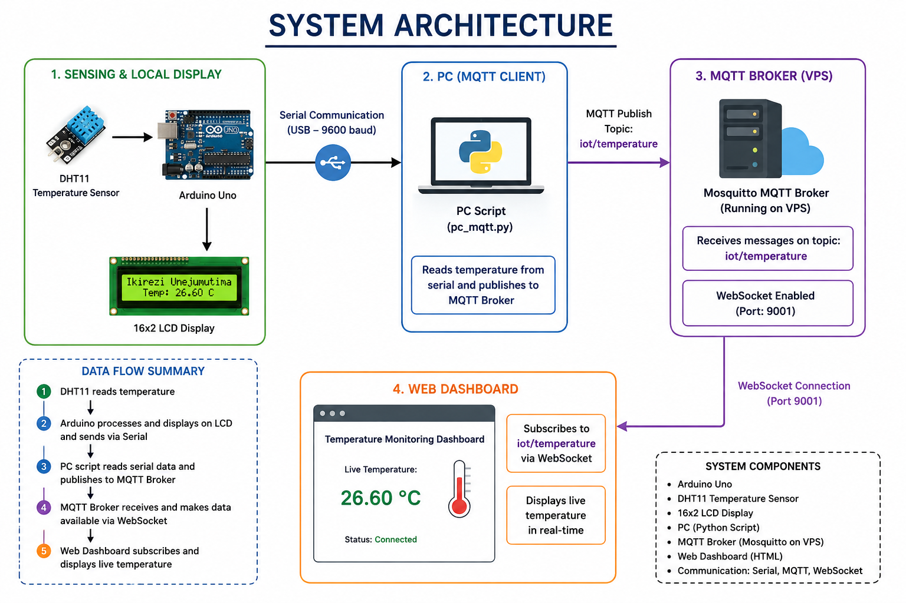

flowchart LR

A[DHT11 Temperature Sensor] --> B[Arduino Uno]

B --> C[16x2 LCD Display]

B --> D[Serial Communication USB 9600]

D --> E[PC Script (pc_mqtt.py)]

E --> F[MQTT Broker on VPS]

F --> G[MQTT Topic: iot/temperature]

F --> H[WebSocket Port 9001]

H --> I[HTML Dashboard (dashboard.html)]

I --> J[Live Temperature Display]
